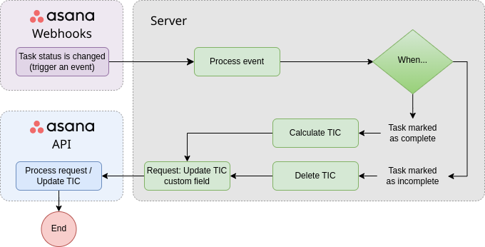

# 👾 Asana automation

This project is an automation using Asana tools for developers. Follow the next steps to run it in your local machine or in a production environment.

## ⚙️ Prerequisites

**NodeJS**

Open-source JavaScript runtime environment to create web applications. More info about node [here](https://nodejs.org/en). Recommended to install it with a version manager for node.js, like [`nvm`](https://github.com/nvm-sh/nvm) or [`fnm`](https://github.com/Schniz/fnm).

**ngrok**

ngrok is a cross-platform application that enables developers to expose a local development server to the Internet with minimal effort. It is used to run the application on a local environment. Check at the following documentation to [install it](https://ngrok.com/docs/getting-started/).

## ⌨️ Installation

1. Clone the repository
2. Assure you have installed Node -v `20.11.0`
3. Assure you have installed `ngrok` ( just for local development )

## 🛠️ Local development

1. Install the dependencies

```shell
npm install
```

2. Setup the environment variables

    - Copy the `.env.example` file into a `.env` file
    - Edit your env variables

3. Run dev environment

```shell
npm run dev
```

4. Run `ngrok` service on the path the server is started. You have to previously set your ngrok account

```shell
ngrok http http://localhost:8080
```

## 🚆 Router and Routes

### Healthcheck

| Route        | HTTP method | Description                            |
| ------------ | ----------- | -------------------------------------- |
| /healthcheck | GET         | Verify if the server is up and running |

### Webhook

| Route                            | HTTP method | Description                          |
| -------------------------------- | ----------- | ------------------------------------ |
| /webhook/first-time-response     | POST        | FTR webhook handshake/receive events |
| /webhook/total-interaction-count | POST        | TIC webhook handshake/receive events |

## 🚀 Asana developers overview

An Asana app makes it possible to extend or enhance what’s possible with Asana. Many people build Asana apps to integrate with other tools, add or extract data, or automate workflows. Check more information about Asana developers at the following links:

-   [**Build an app with Asana**](https://developers.asana.com/docs/overview)
-   [**Authentication**](https://developers.asana.com/docs/authentication)
-   [**API reference**](https://developers.asana.com/reference/rest-api-reference)
-   [**Webhooks Guide**](https://developers.asana.com/docs/webhooks-guide)

## 🤖 Automation: First Response Time (FRT)

This automation calculates the First Response Time (FRT) based on the first comment made by an agent after a task is created.

`FRT` = Time distance between **task creation** and **the first comment made by an agent**.

### Workflow


## 🤖 Automation: Total Interaction Count (TIC)

This automation calculates the Total Interaction Count (TIC) based on the total numbers of comments between the client and the agent after a task is completed.

### Workflow



## Authors

-   [Juan F. Gomez](https://github.com/GomezJuanEfe)
